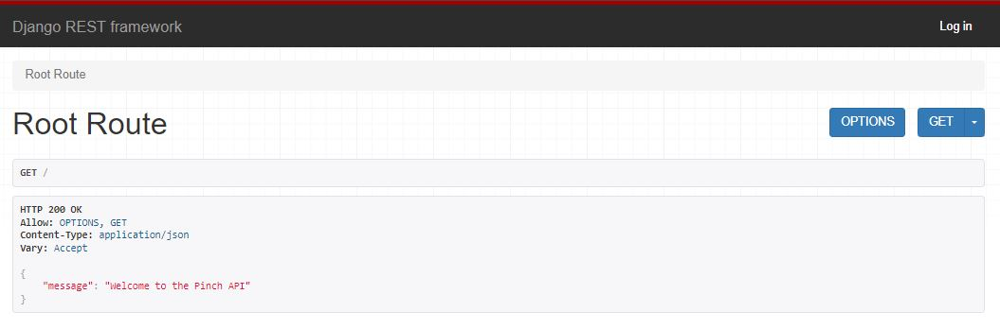

# Pinch API

## Introduction

Pinch API serves as the backend for the Pinch app developed using Django Rest Framework. Pinch is a website is a host that allows users list items they have available for others to borrow, interested users can search for items they need to contact the owner to arrange fee, duration of rent and pick-up/drop-off.

It solves the problem of not having to purchase items that are expensive, only needed for one time use or items that even difficult to acquire or store as after use borrowers give the item back and a fraction of a fee can be charged instead of paying full price.

API allows to hold certain data and functionality for the front-end, developed on ReactJS, to allow users to create and view profiles and posts listings, comments, likes, have edit and delete functions to make the service possible for users.

[Visit the deployed API here](https://pinch-api-f947cf5f7bdc.herokuapp.com/)
[Visit the deployed website here](https://pinch-5e6e24dd12fc.herokuapp.com/)

## API Objective
* Act as a backend to the fron-end ReactJS Pinch app.
* Hold data for users to create profiles and posts, like and comment.
* Allow users to create profiles by registering a profile.
* Allows signed in user to post, like posts and comment on posts.
* Allows users, where appropriate, to perfom CRUD functionality.

# UX - User Experience
* Strategy Plane
* Scope Plane
* Structure Plane
* Skeleton Plane
* Surface Plane

# Strategy Plane
A plan is needed to ensure the purpose of the website meets the needs of site users, the audience, and the site owner.

## Target Audience
The target audience can be a variety of people depending on the item they need but the age ranges will be;
* 18 - 40 year olds

And sub-catergories;
* University students on limited budgets
* Homeowners to maintain their homes where one-time purchases for DIY may be a problem
* People planning events - Need extra tables, chairs, item/ clothing for weddings etc. 

## User Stories
[Link to User Stories](https://github.com/users/StringerMus/projects/7/views/1)

#### Must haves
* A user can update account details
* A user can see a list of the most popular items.
* A logged in user can create a listing to share item listing with other users.
* A user can view a navbar from every page to navigate easily between pages.
* A user can create a new account toaccess all the features for signed up users.
* A user can sign in to the app to access functionality for logged in users.

#### Should haves
* A user can search for items with keywords.
* A logged in user can add comments to an item.
* A user can keep scrolling through listings on the site, that are loaded automatically without pagination.
* A user can view other users profiles to see their item listings and their information.
* A user can click a listing to view more details of an item.
* A user can view other user's profile pictures.
* A user I can view their logged in status.
* A logged in user I can edit their profile to change their profile picture.
* A logged in user I can like a post.

# Scope Plane - FRONT END
I identified 5 main pages that would be needed for the website to be able to function as required;

#### Items listings/ home page.
* This page will contain a list of items posted by users.
* Users can browse all items available.
* A search bar will be available for users to search for items based on name, catergory, location and owner.
* A section of the page will show popular items on the site, popular by likes.
* Logged in users can like posts.

#### Create a listing page
* A form for logged in users post a new item listing.
* Users can fill in information item information and upload an image.

#### Post page
* A page for each item listing for their details can be viewed.
* Logged in users can comment and like posts.
* Item owners can delete or edit post details.

#### Liked page
* Only available for logged in users.
* The page will only show items liked by an owner.

#### Profile page
* Users can view profile details.
* Amount of item listing and list of posts by profile owner.
* Profile owners can edit their user information.

#### Login/ register page
* Sign up page for new users to register
* Login page for existing users to login

## Wireframes
On front-end readme

# Structure Plane
For the website to be able to fulfill its goal of creating profiles, listing and viewing items, liking and commenting on posts;
* Profiles
* Posts
* Likes
* Comments

## Features
I have used the development browser to show and test the API functionality as the deployed API does not have the ability to demonstrate CRUD functionality as this would be for the front-end to utilise.

## Navigation
Navigation around the API is performed via url input, these pages are the following below;

## Login/ logout
There is login/ logout functionality, I will be logged in as admin user 'spock' for the walkthrough.

## Admin Page - /admin
The admin page is gives superuser's/ admin backend admin access to view, create, delete data. In this case it will be pages for the profile, post, comment, and like models.

The development browser stores local data, the data that will be shown in the screenshots will be the testing data and from the deployed API. 

## Profiles
The profile list shows the current list of users created either as a superuser or admin. 

## Posts
The post list shows all posts created by all users and the details recorded for each post including the link to the image is cloudinary, the amount of likes and comments associated with the post.

It also show the number of posts and if there are next or prev pages to navigate to.

#### Detail
It is possible to just look at idividual posts by adding the post id to the url,

#### Form
There is a form at the bottom of the page to be able to post a new listing. Once this is filled and submitted, the post will appear in the post list above.

## Like
The like list shows the recorded likes on the API related and which post the like is linked to via post id, the owner of the like, date created and gives each like an id.

The front-end will use this to allow users to like posts which is possible by recording the like data.

There is a form underneath the which allows to add likes to a post by the user.

## Comments
The comments list shows a list of comments associated to posts. A comment id is created and it records the owner, owner profile id, owner profile image, created at, updated at, post id and the comment made.
Individual comments can also be looked at on the Comments Detail page.

There is a form at the bottom of these pages which allows to add a comment to a chosen post.

## Pagination

# Defensive Design

### Permissions

### User authentication

### 404 Page

# Future Enhancement

# Testing

# Deployment

# Credit

Moneyfield
https://www.tutorialspoint.com/how-to-add-a-money-field-in-django

Decimalfield
https://stackoverflow.com/questions/1139393/what-is-the-best-django-model-field-to-use-to-represent-a-us-dollar-amount

EmailField
https://www.geeksforgeeks.org/emailfield-django-models/

### Tech used

### Media

### Honorable mentions